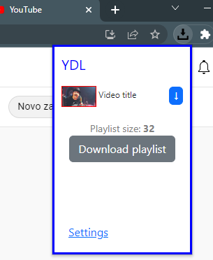

# YDL

##### Youtube music downloader
 

### Set up:
1. [Download server.exe](https://ydl.netlify.app/server.exe)
2. Open server.exe and let it download necessary files (~150mb)
3. Download extension
4. Go to any youtube video -> click on YDL extension -> click download button

### server.exe must be running in the background 